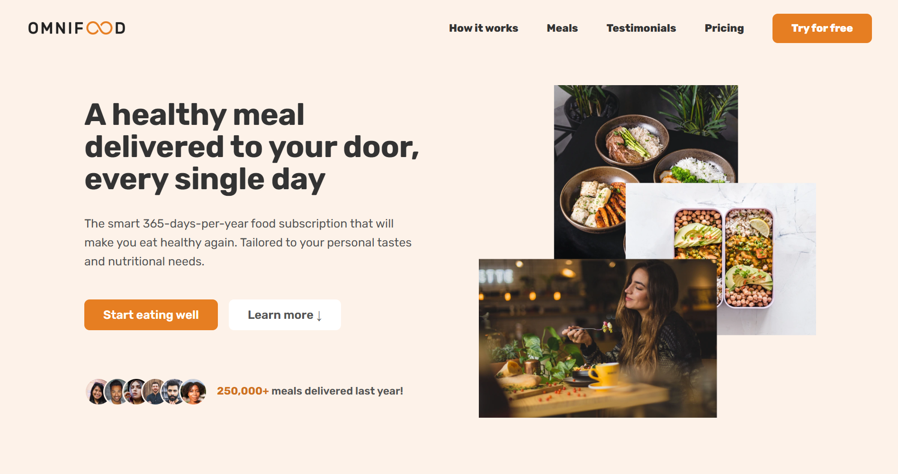

## Omnifood Landing Page🍴

A fully responsive landing page for **Omnifood** — a fictional AI-powered food subscription service that helps people eat healthy every day. 
This project was built to practice modern HTML5 and CSS3 concepts.

🔗 **[Click here to view the live project](https://bahareh-bahrami.github.io/Omnifood/)** 
 

---

### 🚀 Features

- Clean, semantic HTML5 structure
- Responsive layout (mobile, tablet, desktop)
- Modern CSS (Flexbox, Grid, custom properties)
- Sticky navigation, call-to-action sections, and pricing plans
- Optimized for performance and accessibility

---

### 🛠️ Technologies Used

- **HTML5**
- **CSS3**
- **JavaScript (ES6+)**
- **Responsive** Design Principles

---

### 📚 What I Learned

- Structuring a semantic and accessible HTML document
- Building responsive layouts using CSS Grid and Flexbox
- Applying consistent visual hierarchy and spacing

---

